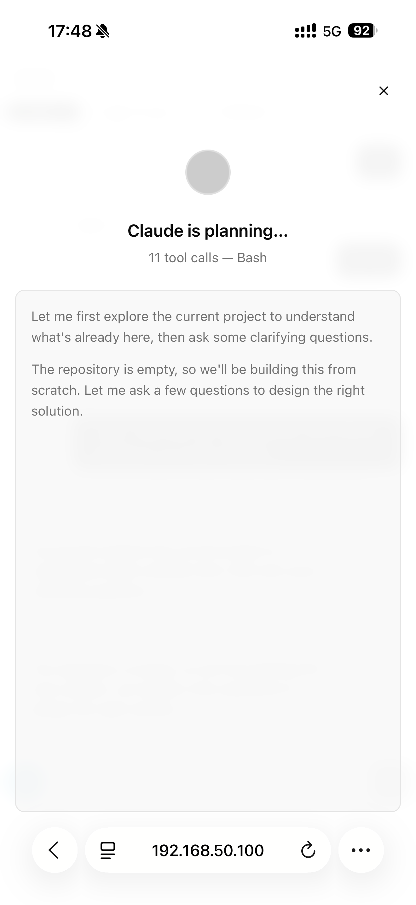
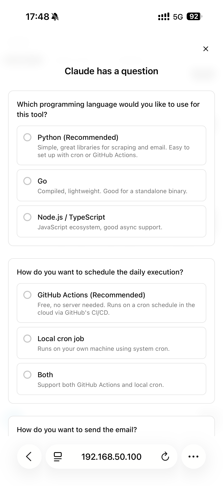
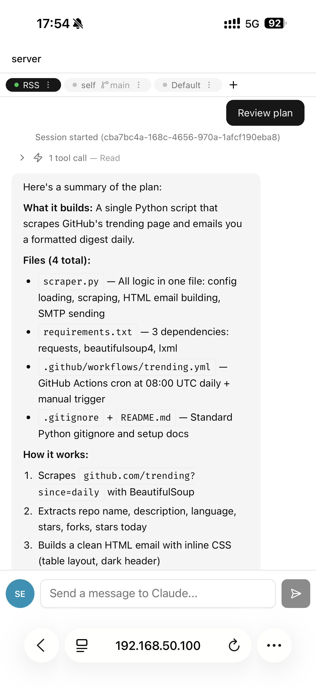
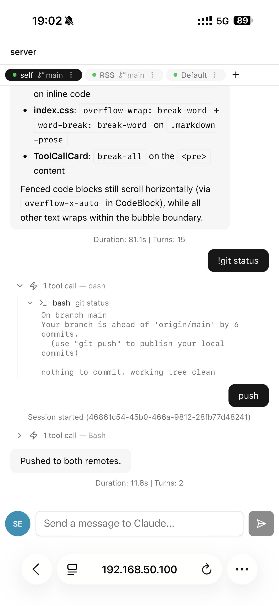

# Gate

[English](README.md) | [中文](README_CN.md)

**Gate** 为远程服务器上的 AI 编程 CLI（[Claude Code](https://docs.anthropic.com/en/docs/claude-code)、[OpenAI Codex](https://github.com/openai/codex)）打开一扇门 — 随时随地，任何设备上编程。

排队、沙发上、地铁里 — 掏出手机，接上之前的工作。Gate 通过 SSH 将浏览器连接到远程 CLI 会话，你的编程环境触手可及。

```
浏览器 (React) ◄──WebSocket──► Node.js 后端 ◄──SSH──► 远程服务器 (Claude / Codex CLI)
```

## 示例

<table align="center">
  <tr>
    <td align="center"><br/><em>计划模式</em></td>
    <td align="center"><br/><em>交互式提问</em></td>
  </tr>
  <tr>
    <td align="center"><br/><em>与 Claude 对话</em></td>
    <td align="center"><br/><em>命令执行</em></td>
  </tr>
</table>

## 核心特性

- **随时随地编程** — 在电脑上开始，手机上继续。会话通过 SSH 和 CLI resume 跨设备持久化。
- **接入已有会话** — 已经在终端跑 CLI 了？Gate 能找到它的日志并从断点处恢复。
- **清爽的聊天界面** — 终端输出解析为 Markdown 消息，可折叠的工具调用卡片，语法高亮代码块，可滚动表格。
- **多服务器、多会话** — 管理多台远程服务器，每台多个会话。滑动或点击切换。
- **实时计划追踪** — 从 Claude 输出中自动提取 checklist 到侧边面板。勾选步骤、编辑计划、发送执行。
- **日志同步** — 通过同步远程 CLI 会话的日志，追上在 Gate 之外完成的工作。
- **全平台响应式** — 桌面三栏布局，平板抽屉模式，手机底部弹出和滑动手势。支持刘海屏。
- **多 CLI 支持** — 支持 Claude Code 和 OpenAI Codex CLI。会话内可切换 CLI 工具，自动同步上下文。切换回之前的工具时自动恢复原有对话，不会创建新会话。
- **切换对话** — 在同一会话内新建 CLI 对话或恢复之前的对话。消息按 CLI 会话隔离，切换后展示干净的视图。
- **持久化历史** — SQLite 存储聊天记录，断线重连和服务器重启都不会丢失。

## 快速开始

### 前置条件

- Node.js >= 20
- 一台有 SSH 访问权限的远程服务器，至少安装以下之一：
  - [Claude Code CLI](https://docs.anthropic.com/en/docs/claude-code) — 在服务器上运行一次 `claude` 完成认证
  - [OpenAI Codex CLI](https://github.com/openai/codex) — 在服务器上运行一次 `codex` 完成认证

### 通过 npm 安装（推荐）

```bash
npm i -g @marukohe/gate
gate
```

在浏览器中打开 `http://localhost:3030`。数据存储在 `~/.gate/`。

CLI 选项：

```bash
gate --port 8080          # 自定义端口（默认 3030）
gate --host 127.0.0.1     # 绑定地址（默认 0.0.0.0）
gate --data-dir /my/data  # 自定义数据目录（默认 ~/.gate）
```

### 添加服务器

打开应用 → 点击 **Add Server** → 填入 SSH 凭据（密码或私钥）。可设置新会话的默认工作目录。

## 开发

### 设置

```bash
git clone https://github.com/Marukohe/Gate.git gate
cd gate
npm install
npm run dev
```

客户端运行在 `http://localhost:5173`（API/WS 代理到 3030 端口的服务端）。

### 脚本

| 命令 | 说明 |
|------|------|
| `npm run dev` | 同时启动客户端和服务端 |
| `npm run dev:client` | 仅启动 Vite 开发服务器（5173 端口） |
| `npm run dev:server` | 仅启动 Express + WS 服务端（3030 端口） |
| `npm run build` | 构建客户端和服务端 |
| `npm run start` | 启动生产环境服务端 |
| `cd server && npx vitest run` | 运行服务端测试 |
| `cd server && npx tsc --noEmit` | 服务端类型检查 |

## 项目结构

```
gate/
├── client/                      # React 前端
│   └── src/
│       ├── components/
│       │   ├── chat/            # ChatView, SessionBar, MessageBubble, ToolActivityBlock,
│       │   │                    # ChatInput, ProviderSwitcher, ResumeChatDialog, BranchSwitcher
│       │   ├── layout/          # AppShell, Sidebar, TopBar
│       │   ├── plan/            # PlanPanel, PlanStepItem
│       │   ├── plan-mode/       # PlanModeOverlay, PlanModeQuestion, PlanModeThinking
│       │   ├── server/          # ServerDialog
│       │   └── ui/              # shadcn/ui 组件
│       ├── hooks/               # use-websocket, use-swipe
│       ├── stores/              # Zustand stores (server, session, chat, plan, plan-mode, ui)
│       └── lib/                 # 工具函数 (plan-parser, server-utils, notification)
├── server/                      # Node.js 后端
│   └── src/
│       ├── index.ts             # Express 入口
│       ├── db.ts                # SQLite (servers, sessions, messages)
│       ├── ssh-manager.ts       # SSH 连接池 + CLI 通道管理
│       ├── ssh-browse.ts        # 远程目录浏览
│       ├── ws-handler.ts        # WebSocket 服务端
│       ├── routes/              # REST API
│       ├── providers/
│       │   ├── types.ts         # CLIProvider 接口, OutputParser, ParsedMessage
│       │   ├── registry.ts      # Provider 注册与查找
│       │   ├── claude/          # Claude Code CLI provider
│       │   └── codex/           # OpenAI Codex CLI provider
│       └── __tests__/           # Vitest 测试套件
└── docs/                        # 设计文档
```

## 技术栈

**客户端：** Vite · React 19 · TypeScript · Tailwind CSS · shadcn/ui · Zustand

**服务端：** Express 5 · ws · ssh2 · better-sqlite3 · TypeScript

**测试：** Vitest

## 为什么叫 "Gate"？

取自《命运石之门》(*Steins;Gate*) — 那部消息穿越时间改变世界线的动画。在这里，你的消息通过 SSH 穿越到远程服务器上的 Claude，为你的任何设备和编程环境之间打开一扇门。

## 许可证

MIT
